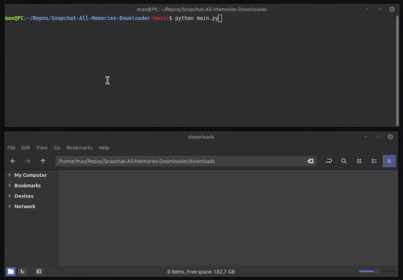

# Snapchat Memories Downloader

[](https://www.python.org/downloads/)
[](https://opensource.org/licenses/MIT)
[](https://github.com/X-Abhishek-X/Snapchat-All-Memories-Downloader/graphs/commit-activity)

A powerful, high-performance Python tool designed to automate the download of your Snapchat memories from a data export. This enhanced version provides a robust, concurrent solution for users looking to back up their personal media with full metadata preservation.



## 🌟 Why Use This Tool?

Snapchat recently introduced storage limits (5GB) for memories, requiring a premium subscription for larger libraries. This tool empowers you to:
- **Reclaim Your Data**: Download all memories to local storage.
- **Preserve Quality**: High-quality downloads using direct CDN links.
- **Maintain Metadata**: Automatic EXIF embedding for dates and location.
- **Save Time**: Fully automated concurrent processing.

## 🚀 Key Features

- **🔄 Intelligent Retry System**: Automatically handles network fluctuations and retries failed downloads with exponential backoff.
- **⏰ Smart Timezone Handling**: Converts UTC timestamps to your local system's timezone for accurate file dating.
- **📊 Real-time Progress Tracking**: Interactive dashboard showing download speed (MB/s), file counts, and remaining tasks.
- **📍 EXIF Metadata Preservation**: Automatically injects original capture date and GPS coordinates into image metadata.
- **⚡ Concurrent Engine**: Asynchronous architecture allowing up to 40+ simultaneous downloads.
- **🧹 JSON State Sync**: Automatically updates your export file to skip successfully downloaded items on subsequent runs.

## 🛠️ Installation

### Prerequisites

- **Python 3.10+**
- **pip** (Python package manager)

### Quick Start

1. **Clone the Repo**
   ```bash
   git clone https://github.com/X-Abhishek-X/Snapchat-All-Memories-Downloader.git
   cd Snapchat-All-Memories-Downloader
   ```

2. **Install Requirements**
   ```bash
   pip install -r requirements.txt
   ```

## 📥 How to Get Your Data

1. Access your account at [accounts.snapchat.com](https://accounts.snapchat.com/).
2. Navigate to **Download My Data**.
3. **Critical**: Ensure both `Export your Memories` and `Export JSON Files` are selected.
4. Submit the request and wait for the confirmation email (this can take from a few hours to a day).


## 💻 Usage Guide

### 1. Prepare Your Workspace
Extract your Snapchat ZIP export and move the `memories_history.json` (found in the `/json/` folder) into a `json/` folder inside this project directory.

```text
Snapchat-All-Memories-Downloader/
├── main.py
└── json/
    └── memories_history.json
```

### 2. Execute the Downloader
**Standard Run:**
```bash
python main.py
```

**Advanced Configuration:**
```bash
# Custom output folder and 20 concurrent threads
python main.py -o ./my_backup -c 20
```

### 3. Command Line Arguments
| Flag | Description | Default |
| --- | --- | --- |
| `-o, --output` | Target directory for downloads | `./downloads` |
| `-c, --concurrent` | Max simultaneous download tasks | `40` |
| `--max-retries` | Retry limit per file | `3` |
| `--no-exif` | Skip metadata embedding | `False` |
| `--no-skip-existing` | Force re-download of existing files | `False` |

## 🛡️ Disclaimer

This tool is provided for **personal data backup purposes only**. It uses the official data export provided by Snapchat. Use this tool responsibly and in accordance with Snapchat's Terms of Service.

## 🤝 Contributing

Contributions are welcome! If you find a bug or have a feature request, please [open an issue](https://github.com/X-Abhishek-X/Snapchat-All-Memories-Downloader/issues/new).

## 📄 License

Distributed under the MIT License. See `LICENSE` for more information.

---
**Maintained by [X-Abhishek-X](https://github.com/X-Abhishek-X)**
